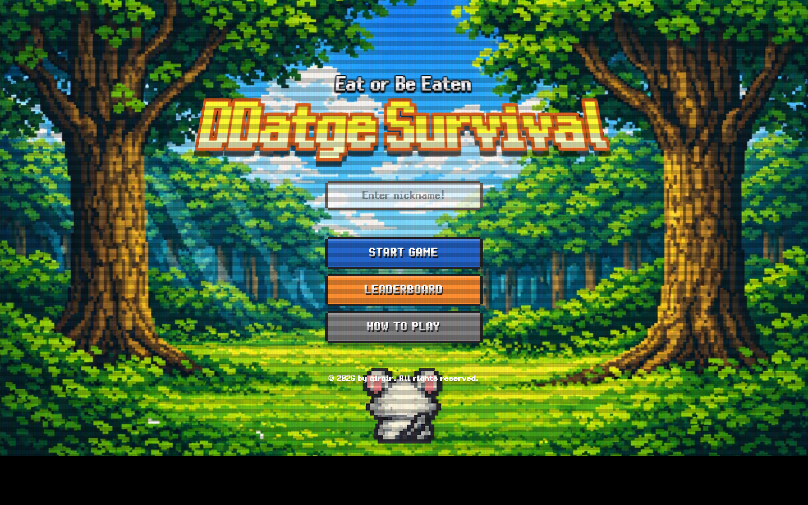
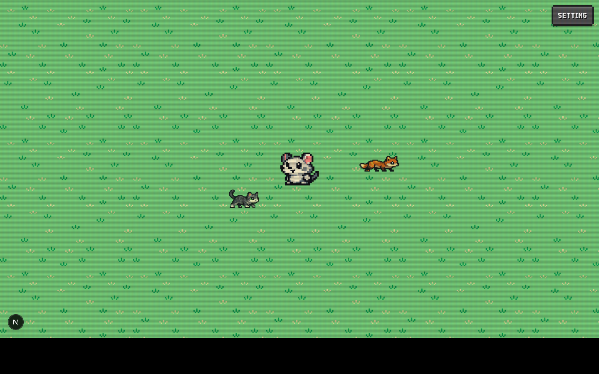
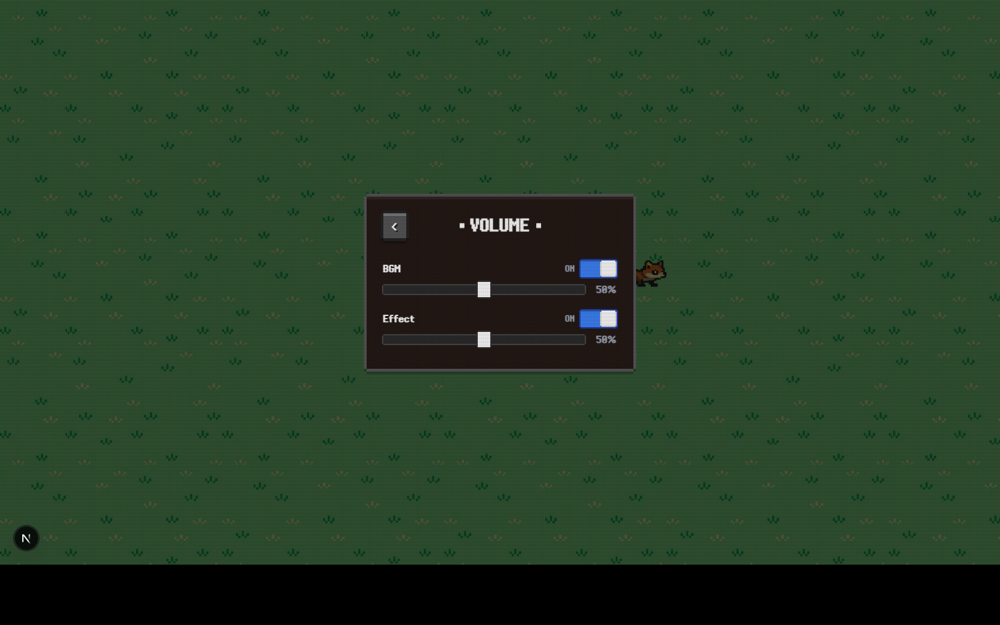
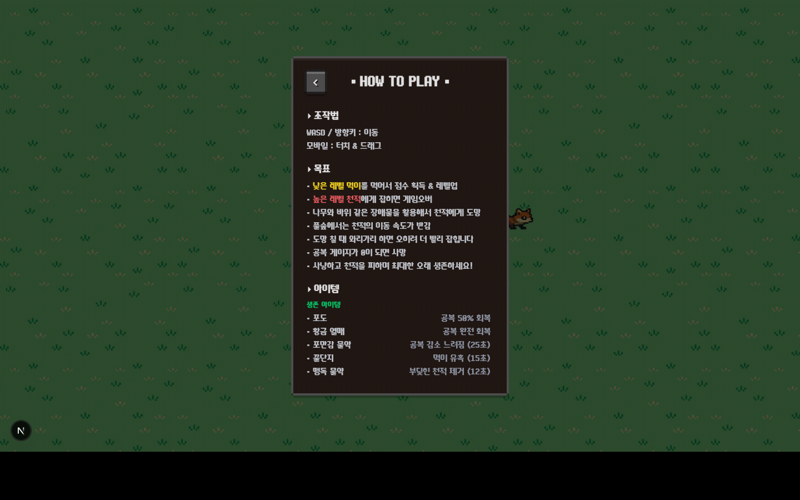
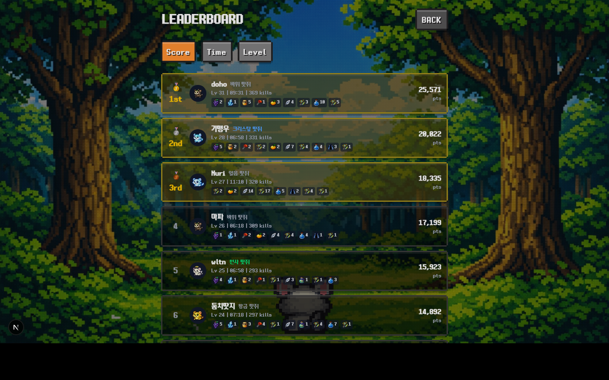
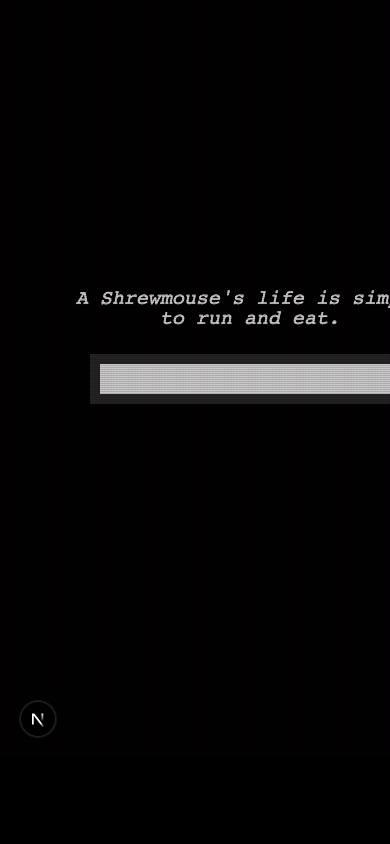

# DDatge Survival
뱀파이어 서바이벌 + agar.io 감성의 탑다운 성장형 생존 게임입니다.  
플레이어는 작은 땃쥐로 시작해 먹이사슬을 따라 성장하고, 공복 게이지를 관리하며 최대한 오래 생존합니다.

## 1. 게임 개요

### 컨셉
- 장르: 탑다운 액션 서바이벌, 로그라이크(run-based), 성장형 게임
- 핵심 감정: 성장 쾌감 + 생존 긴장감 + 짧고 반복 가능한 세션
- 한 판 목표: 먹이 확보, 공복 관리, 천적 회피, 최고 점수 갱신

### 핵심 플레이 루프
1. 이동(키보드/모바일 조이스틱)으로 먹이를 탐색
2. 낮은 레벨 NPC를 포식해 점수/공복 회복
3. 레벨업으로 스탯 성장 + 생태계 난이도 상승
4. 아이템/스킬/코스튬을 활용해 생존 시간 확장
5. 사망 후 기록 저장 및 리더보드 경쟁

### 주요 포인트
- 명확한 먹이사슬 규칙: `낮은 레벨은 포식`, `동레벨은 대치`, `높은 레벨은 위협`
- 공복 시스템 기반 압박: 시간 경과에 따라 지속적으로 의사결정 유도
- 동적 생태계: 플레이어 레벨 기반으로 NPC 분포가 계속 재편
- 메타 진행: 누적 점수로 스킬 언락/구매, 코스튬 수집, 슬롯 확장

## 2. 게임 기획 관점의 시스템 설계

### 먹이사슬/레벨
- 규칙: `npcLevel < playerLevel`만 포식 가능 (`FoodChain`)
- 레벨업 요구치: 레벨별 누적 점수 기반 (`LevelSystem`)
- 보스(특수 레벨) 출현 구간 존재

### 공복(Hunger)
- 생존 자원: 공복이 0이 되면 즉시 게임오버
- 레벨 상승에 따라 공복 소모량이 커져 후반 압박 증가
- 먹이 포식/아이템으로 공복 회복 또는 소모 완화

### 동적 생태계/NPC AI
- 플레이어 레벨 근처 대역을 중심으로 스폰 밀도 제어 (`NPCManager`)
- 배회/추격/도주 상태 기반 행동
- 미니맵용 NPC 위치 동기화 최적화(주기 업데이트)

### 아이템/스킬/코스튬
- 아이템: 생존/버프/코스튬 카테고리 분리
- 스킬: 누적 점수 언락 + 화폐 구매 + 슬롯 장착(최대 3 슬롯 확장형)
- 코스튬: 플레이 중 획득 및 메타 보존, 리더보드 표시에 반영

## 3. FE 아키텍처

### 렌더링 레이어 분리
- `Next.js App Router`: 페이지/레이아웃/API 라우팅
- `Phaser`: 실시간 월드 시뮬레이션 및 물리
- `React UI`: HUD, 모달, 리더보드, 게임오버 오버레이

### 상태 관리
- `Zustand` 기반 전역 상태
- `gameStore`: 점수, 레벨, 공복, 버프, 위치, 게임 상태
- `audioStore`: BGM/SFX 볼륨, 음소거, 로컬 저장

### 엔진-UI 브릿지
- `EventBus`로 Phaser <-> React 간 이벤트 전달
- 예: `pause-game`, `resume-game`, `level-up`, `game-over`, `audio-settings-changed`

## 4. 시스템 설계(구현 구조)

```text
[Home / Game / Leaderboard (Next.js)]
            |
            v
[React UI + Zustand Store]
            |
        EventBus
            |
            v
[Phaser Scenes]
  - PreloadScene (에셋 로드)
  - GameScene    (코어 루프)
  - UIScene      (모바일 조이스틱)
            |
            v
[Managers / Systems]
  - NPCManager / ItemManager / SkillManager
  - HungerSystem / LevelSystem / FoodChain
            |
            v
[API Routes]
  - /api/scores (기록/리더보드/메타 데이터)
  - /api/skills (스킬 구매)
  - /api/slots  (슬롯 구매)
            |
            v
[Supabase]
```

## 5. 기술 스펙

| 항목 | 내용 |
|---|---|
| Frontend | Next.js 16 (App Router), React 19, TypeScript |
| Game Engine | Phaser 3 (Arcade Physics) |
| State | Zustand |
| Backend | Next.js Route Handlers |
| DB/BaaS | Supabase |
| 주요 해상도 | 기본 800x600, 모바일 대응(브레이크포인트 960) |
| 맵 | 타일 기반 월드 + 장애물 + 동적 확장 요소 |

## 6. 주요 디렉토리

```text
src/
  app/
    page.tsx                # 메인 메뉴
    game/page.tsx           # 게임 페이지
    leaderboard/page.tsx    # 리더보드
    api/
      scores/route.ts
      skills/route.ts
      slots/route.ts
  components/
    game/                   # HUD, 캔버스, 게임오버 등
    ui/                     # 설정/도움말 모달
  lib/
    phaser/
      scenes/
      systems/
      entities/
      data/
    userId.ts
    supabase.ts
  store/
    gameStore.ts
    audioStore.ts
```

## 7. 실행 방법

```bash
npm install
npm run dev
```

- 브라우저: `http://localhost:3000`

## 8. 환경 변수

`.env.local` 예시:

```bash
NEXT_PUBLIC_SUPABASE_URL=your-supabase-url
NEXT_PUBLIC_SUPABASE_ANON_KEY=your-supabase-anon-key
SUPABASE_SERVICE_KEY=your-supabase-service-key
```

## 9. 화면 캡처

### Home


### Home - How To Play Modal


### Game


### Game - Sound Modal


### Game - How To Play Modal


### Leaderboard


### Mobile Snapshot


## 10. 참고 문서
- PRD: `ddatge-survival_PRD.md`
